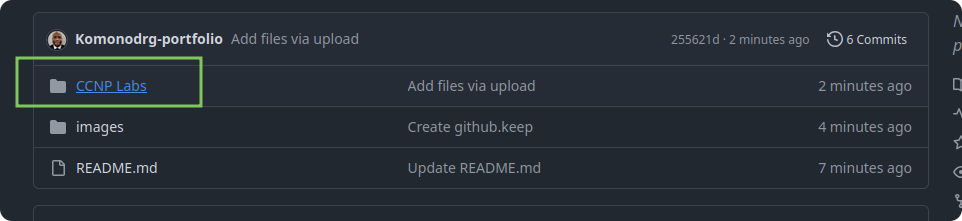
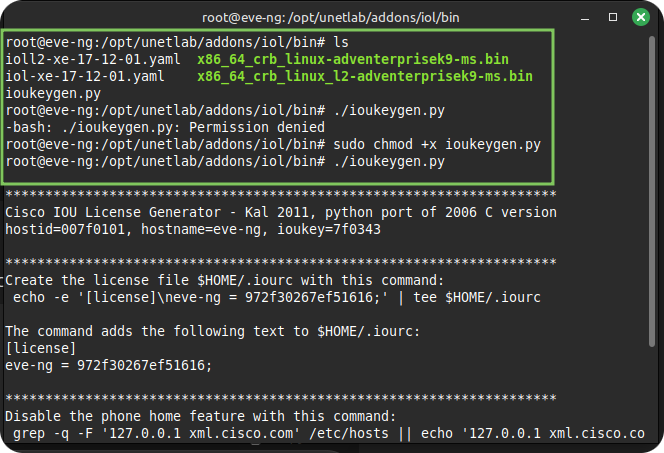
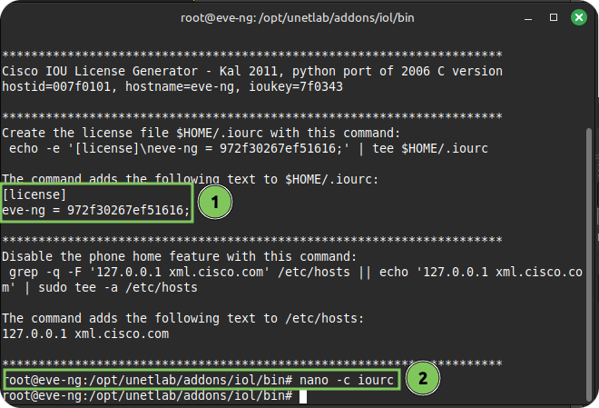
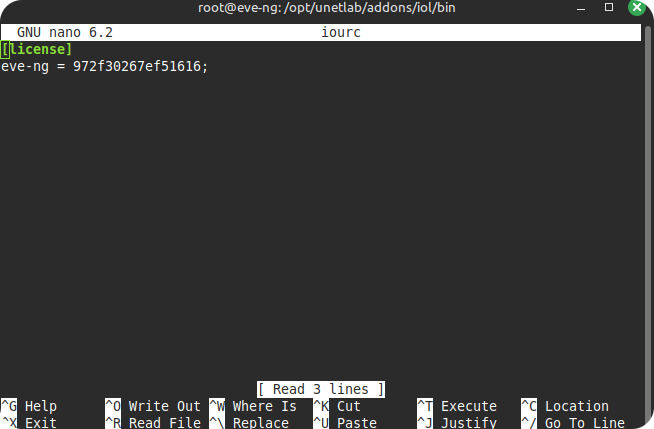
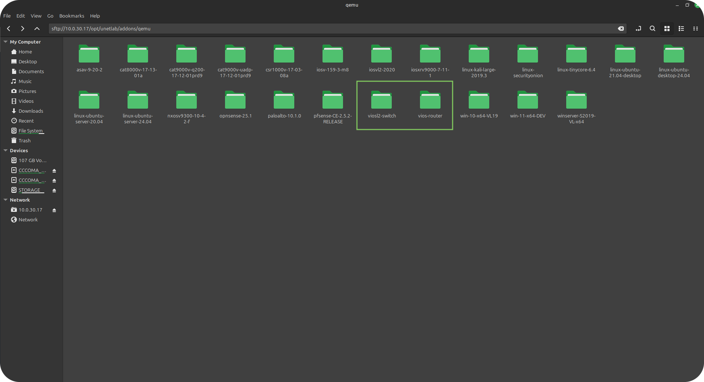
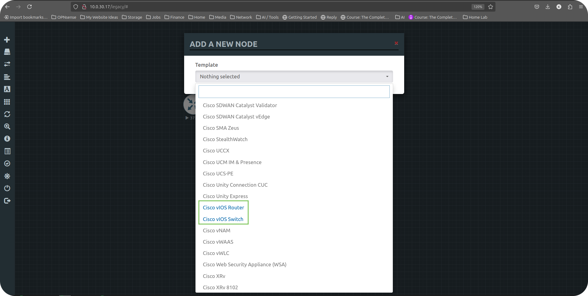

### [Cybersecurity](https://github.com/Komonodrg-portfolio/Cybersecurity) | [Networking](https://github.com/Komonodrg-portfolio/Networking) | [Data Science (AI)](https://github.com/Komonodrg-portfolio/AI) | [Media Creation](https://github.com/Komonodrg-portfolio/MediaCreation) | [Mission](https://github.com/Komonodrg-portfolio/Mission/)

---
---

# 🌐 CCNP Labs (Encore 350-401)

This repo project demonstrates my self study prep of CCNP comptetencies using **EVE-NG (Emulated Virtual Environment Next Generation)** in preperation for certification acquisition. It showcases that not alot of financial resourcs are needed in order to pursue your education goals in becoming a competent CCNP level Network Engineer.   With a labtop of 16GB  (recommended) of ram, this platform allows training from anywhere in the world.

---

## 📌 Goals
To illustrate a cost effective platform to  allow for the practice and self study in Network Engineering via providing the ability to:

- Design and emulate a complex network topology
- Practice configuration of Cisco routers, Layer 2/3 switches, and firewalls
- Test routing protocols (OSPF, EIGRP, BGP)
- Implement VLANs and inter-VLAN routing
- Simulate internet connectivity with NAT/PAT
- Prepare for CCNA/CCNP certification as well as network automation

---

## 🧰 Tools & Technologies

| Tool       | Purpose                              |
|------------|--------------------------------------|
| EVE-NG     | Network Emulation Platform           |
| Cisco IOU / Dynamips | Router & Switch Emulation         |
| SD-WAN    | Overlay network implementation over core underlay routing          |
| Linux  / Windows VMs  | Host Simulation and network automation                     |
| Wireshark  | Packet Capture and Analysis          |

---

---

## 🔧 Webpage Navigation

Rather then creating a individual repo per lab on github, I decided to employ the use of jupyter notebooks for each lab.  You can view individual labs via the folder hierachy on this page:




### Prerequisites

Please view my [EVE-NG setup tutorial](https://github.com/Komonodrg-portfolio/---N---Home_Lab_Networking) for lab environment setup.  For L3 (Router) and L2 (Switch) files, there are 2 main flavors commonly used:
- IOL (contains less features, but requires less system resources to run allowing more nodes to run successfully)
- vIOS (more feature rich, requiring more system resources to run)

<details>
 <summary><h4>a)  IOL Image Setup</h4></summary>
  <br> 
 
```
Place IOL image files on EVE-NG in folder /opt/unetlab/addons/iol/bin folder location 
  └─ Also place license generation file.py in same folder
  └─ Change execution permission on the file via: sudo chmod +x <filename>
  └─ 1) Copy License information generated
  └─ 2) Paste contents into iourc file you'll create via: nano -c iourc > Ctrl + X > Enter to save
  └─ Fix permission via command:  /opt/unetlab/wrappers/unl_wrapper -a fixpermissions

IOL images should now run successfully after starting and able to console into
```
<p float="center">
  
  
  

</details>
<details>
 <summary><h4>b) vIOS Image Setup </h4></summary>
 
  ```
Place vIOS image files in folders on EVE-NG in folder /opt/unetlab/addons/qemu folder location
   └─ For L2 switch, make sure folder is named: viosl2-<foldername choice>
   └─ For L2 router, make sure folder is named: vios-<foldername choice>
   └─ Fix permission via command:  /opt/unetlab/wrappers/unl_wrapper -a fixpermissions

vIOS images should now run successfully after starting and able to console into
```
<p float="center">
  
  

</details> 
<details>
 <summary><h4>c) Alternative methods to console into lab devices</h4></summary>
  <br> 
  
If you are looking for alternative variations for logging into router/switch consoles or graphical gui devices, please follow [these steps](https://chatgpt.com/s/t_69005aadc8248191a1464a2e8028066a) and dig deeper for more custom configurations to suit your preferences.
 
</details> 


<h2> 🤳 Connect with me:</h2>

[][youtube]
[][tiktok]
[][linkedin]
[][instagram]

[tiktok]: https://tiktok.com/upcoming...
[youtube]: https://www.youtube.com/@EvenSteveTech
[instagram]: https://www.instagram.com/upcoming...
[linkedin]: https://www.linkedin.com/in/steven-komono-71790197/
