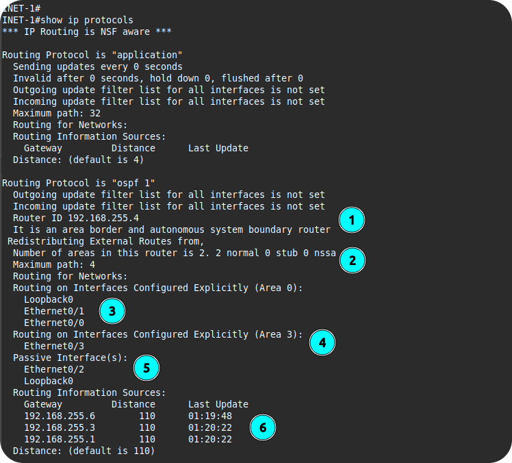
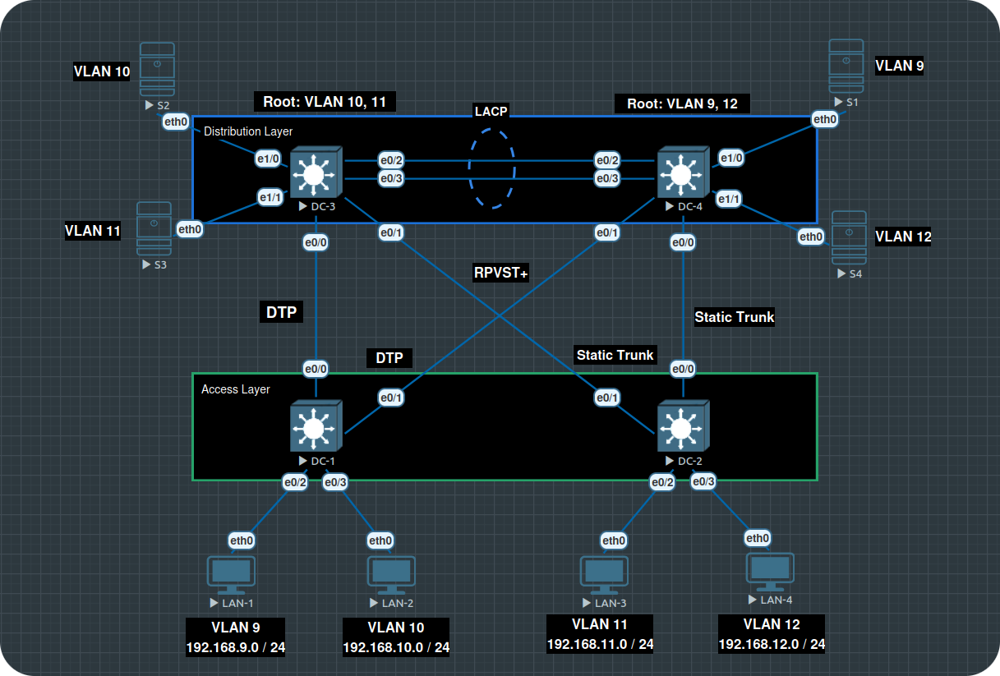

### [Cybersecurity](https://github.com/Komonodrg-portfolio/Cybersecurity) | [Networking](https://github.com/Komonodrg-portfolio/Networking) | [Data Science (AI)](https://github.com/Komonodrg-portfolio/AI) | [Media Creation](https://github.com/Komonodrg-portfolio/MediaCreation) | [Mission](https://github.com/Komonodrg-portfolio/Mission/)

---
---

# 🌐 CCNP Labs (Encore 350-401)

This repo project demonstrates my self study prep of CCNP comptetencies using **EVE-NG (Emulated Virtual Environment Next Generation)** in preperation for certification acquisition. It showcases that not alot of financial resourcs are needed in order to pursue your education goals in becoming a competent CCNP level Network Engineer.   With a labtop of 16GB  (recommended) of ram, this platform allows training from anywhere in the world.

---

## 📌 Goals
To illustrate a cost effective platform to  allow for the practice and self study in Network Engineering via providing the ability to:

- Design and emulate a complex network topology
- Practice configuration of Cisco routers, Layer 2/3 switches, and firewalls
- Test routing protocols (OSPF, EIGRP, BGP)
- Implement VLANs and inter-VLAN routing
- Simulate internet connectivity with NAT/PAT
- Prepare for CCNA/CCNP certification as well as network automation

---

## 🧰 Tools & Technologies

| Tool       | Purpose                              |
|------------|--------------------------------------|
| EVE-NG     | Network Emulation Platform           |
| Cisco IOU / Dynamips | Router & Switch Emulation         |
| SD-WAN    | Overlay network implementation over core underlay routing          |
| Linux  / Windows VMs  | Host Simulation and network automation                     |
| Wireshark  | Packet Capture and Analysis          |

---

## ⚙️ Prerequisites

Please view my [EVE-NG setup tutorial](https://github.com/Komonodrg-portfolio/---N---Home_Lab_Networking) for lab environment setup. <br> 

For L3 (Router) and L2 (Switch) files, there are 2 main flavors commonly used:
- IOL (contains less features, but requires less system resources to run allowing more nodes to run successfully)
- vIOS (more feature rich, requiring more system resources to run)

<details>
 <summary><h4>a)  IOL Image Setup</h4></summary>
  <br> 
 
```
Place IOL image files on EVE-NG in folder /opt/unetlab/addons/iol/bin folder location 
  └─ Also place license generation file.py in same folder
  └─ Change execution permission on the file via: sudo chmod +x <filename>
  └─ 1) Copy License information generated
  └─ 2) Paste contents into iourc file you'll create via: nano -c iourc > Ctrl + X > Enter to save
  └─ Fix permission via command:  /opt/unetlab/wrappers/unl_wrapper -a fixpermissions

IOL images should now run successfully after starting and able to console into
```
<p float="center">
  
  
  

</details>
<details>
 <summary><h4>b) vIOS Image Setup </h4></summary>
 
  ```
Place vIOS image files in folders on EVE-NG in folder /opt/unetlab/addons/qemu folder location
   └─ For L2 switch, make sure folder is named: viosl2-<foldername choice>
   └─ For L2 router, make sure folder is named: vios-<foldername choice>
   └─ Fix permission via command:  /opt/unetlab/wrappers/unl_wrapper -a fixpermissions

vIOS images should now run successfully after starting and able to console into
```
<p float="center">
  

</details> 
<details>
 <summary><h4>c) Alternative methods to console into lab devices</h4></summary>
  <br> 
  
If you are looking for alternative variations for logging into router/switch consoles or graphical gui devices, please follow [these steps](https://chatgpt.com/s/t_69005aadc8248191a1464a2e8028066a) and feel free dig deeper for more custom configurations to suit your preferences.
 
</details> 

<h2>🪂 <em>"One Man's Thoughts..."</em></h2>
<em>After a decade+ of studying, labbing, and extensive note taking in my Network Engineering Journey, I felt it was a good idea to get alot of knowledge and theory down in a practical manner for project presentation.  Though I still refer  alot to the notes of yesteryear contained in my lengthy Onenote gathering...whew, you'll see from the screenshot that it gets a bit much to navigate through:<br>
<br>
<p float="center">
  
<br>

Learning is a lifelong journey and we all go about it in our own way.  I've always been a self starter, constantly seeking and pushing towards non-conventional methods for obtaining the knowledge I know I needed to get to where I wanted trajectory of my life to go.  Has the trial and error always gone as planned - ABSOLUTELY NOT... but it's the spice of life that keeps things interesting and builds resolve to just keep going after picking yourself up, dusting yourself off, and shaking off the disapointments and setbacks.  This CCNP Lab repo, I hope, will show my resolve to constantly get better, even if revisiting the chapters of my professional journey in Networking seems a bit combersome at times.<br>
<br>
Big shout out to the pioneers who shaped my educational yesteryear; from the countless  CBT Nugget series videos and Kevin Wallace - who personally explained networking to me in an easy, digestable format that allowed this free thinker to finally make sense of the Networking jumble.  Salute.

<br>Colleagues, Onward.</em><br> 

---

## 🧪 LABS

<details>
<summary><h3> EIGRP </h3></summary>
 <br> 
  <details>
 <summary><h3>1) EIGRP Multi-AS</h3></summary>

## Topology:

<p float="center">
  <br>

 ## Requirements:

1) Enable EIGRP globally on all routers

2) Configure router id manually on all routers.
3) Advertise LAN segments, WAN connected subnets and loopbacks
4) Enable passive interface for LAN segments and loopbacks
5) Do not redistribute routes between AS 100 and AS 200
6) Verify EIGRP neighbor adjacenty and routing tables
   - show ip eigrp neighbors
   - show ip route eigrp
   - show ip route (R4)
7) Redistribute eigrp (as number) for advertising between EIGRP AS's 
 
 

 </details>

</details>  

<details>
 <summary><h3>1) OSPFv2 Multi Area</h3></summary>
  <br> 

The aim for this lab is to showcase configuration and OSPF verification.  Theoretcial knowledge on the OSPF routing protocol can be found [here](https://www.cisconetsolutions.com/ospf-routing-protocol-deep-dive/). 
  

## Topology:
<p float="center">
  <br>

## Requirements:

1) Enable OSPF on all R1, R2, R3, INET-1 interfaces with interface method

2) Configure passive interfaces on LAN Segments and loopbacks

3) Enable OSPF on Remote-1 and Remote-2 interfaces with global method

4) Advertise all LAN segments, WAN connected subnets, and loopbacks

5) Advertise default route from INET-1 to downstream routers for internet access

6) Verify lab configuration and OSPF routing tables
 - show ip ospf neighbor (R1, INET-1, R3)
 - show ip route ospf (R1, INET-1, R3)
 - show ip protocols (R1)
 - show ip ospf interface (R1, INET-1, Remote-1)
 - ping (LAN-2, ISP, Remote-1)

## Verification:

Will take a look at OSPF learned networks and checks only from INET-1 perspective here & verify Pings - proving connectivity... all other verification checks from lab requirements successful ✔️.

<p float="center">
  
  

  ```
Show ip ospf neighbor
   └─ 1) Shows Management (loopback) addresses for directly connected neighbors

Show ip route ospf
   └─ 2) Show learned routes through OSPF, make note of Remote routes (172...) learned from summary route configured from Remote-1
   └─ 3) Also showing the point-to-point routes for interface IPs configured connecting OSPF participating routers
```

```
Show ip protocols
  └─ 1) Shows Management (loopback) addresses for INET-1 (192.168.255.4)
  └─ 2) Indicates INET-1 as both ABR and ASBR, also showing directly connected OSPF areas (0 & 3)
  └─ 3) Shows participating interfaces in Area 0
  └─ 4) Shows participating interfaces in Area 3
  └─ 5) Shows passive interfaces (interfaces where routes will not be advertised, but still run - reducing routing table overhead)
  └─ 6) Shows neighboring OSPF Participating routers
```
 <details>
  <summary><h3>Configurations </h3></summary>

 R1:
 
  ```
hostname R1

interface Loopback0
 description Management Interface
 ip address 192.168.255.1 255.255.255.255
 ip ospf 1 area 0

interface Ethernet0/0
 description link to R2 router
 ip address 192.168.1.2 255.255.255.252
 ip ospf 1 area 1
 duplex auto
 speed auto
 media-type rj45

interface Ethernet0/1
 description link to INET-1 router
 ip address 192.168.1.9 255.255.255.252
 ip ospf 1 area 0
 duplex auto
 speed auto
 media-type rj45

interface Ethernet0/2
 description link to R3 router
 ip address 192.168.1.5 255.255.255.252
 ip ospf 1 area 0
 duplex auto
 speed auto
 media-type rj45

router ospf 1
 passive-interface Loopback0
```
R2:
```
hostname R2

interface Loopback0
 description Management Interface
 ip address 192.168.255.2 255.255.255.255
 ip ospf 1 area 1

interface Ethernet0/0
 description link to R1 router
 ip address 192.168.1.1 255.255.255.252
 ip ospf 1 area 1
 duplex auto
 speed auto
 media-type rj45

interface Ethernet0/1
 description LAN (172.16.1.0/24)
 ip address 172.16.1.254 255.255.255.0
 ip ospf 1 area 1
 duplex auto
 speed auto
 media-type rj45

router ospf 1
 passive-interface default
 no passive-interface Ethernet0/0
```
R3:
```
hostname R3

interface Loopback0
 description Management Interface
 ip address 192.168.255.3 255.255.255.255
 ip ospf 1 area 0

interface Ethernet0/0
 description link to R1 router
 ip address 192.168.1.6 255.255.255.252
 ip ospf 1 area 0
 duplex auto
 speed auto
 media-type rj45

interface Ethernet0/1
 description link to INET-1 router
 ip address 192.168.1.13 255.255.255.252
 ip ospf 1 area 0
 duplex auto
 speed auto
 media-type rj45

interface Ethernet0/2
 description link to Remote-1
 ip address 192.168.1.17 255.255.255.252
 ip ospf 1 area 2
 duplex auto
 speed auto
 media-type rj45

router ospf 1
 passive-interface Loopback0
```
INET-1:
```
hostname INET-1

interface Loopback0
 description Management Interface
 ip address 192.168.255.4 255.255.255.255
 ip ospf 1 area 0

interface Ethernet0/0
 description link to R1 router
 ip address 192.168.1.10 255.255.255.252
 ip ospf 1 area 0
 duplex auto
 speed auto
 media-type rj45

interface Ethernet0/1
 description link to R3 router
 ip address 192.168.1.14 255.255.255.252
 ip ospf 1 area 0
 duplex auto
 speed auto
 media-type rj45

interface Ethernet0/2
 description link to ISP router
 ip address 172.33.1.1 255.255.255.252
 duplex auto
 speed auto
 media-type rj45

interface Ethernet0/3
 description link to Remote-2 router
 ip address 192.168.1.21 255.255.255.252
 ip ospf 1 area 3
 duplex auto
 speed auto
 media-type rj45

router ospf 1
 passive-interface Ethernet0/2
 passive-interface Loopback0
 default-information originate

ip route 0.0.0.0 0.0.0.0 172.33.1.2
```
Remote-1:
```
hostname Remote-1

no logging console

vtp mode transparent

spanning-tree mode rapid-pvst

vlan 10-12 

interface Loopback0
 description Management Interface
 ip address 192.168.255.5 255.255.255.255

interface Ethernet0/1
 switchport access vlan 10
 switchport mode access
 media-type rj45
 negotiation auto

interface Ethernet0/2
 switchport access vlan 11
 switchport mode access
 media-type rj45
 negotiation auto
         
interface Ethernet0/3
 switchport access vlan 12
 switchport mode access
 media-type rj45
 negotiation auto

interface Ethernet0/0
 description link to R3 router
 no switchport
 ip address 192.168.1.18 255.255.255.252
 negotiation auto

interface Vlan10
 ip address 172.16.10.254 255.255.255.0

interface Vlan11
 ip address 172.16.11.254 255.255.255.0

interface Vlan12
 ip address 172.16.12.254 255.255.255.0
         
router ospf 1
 passive-interface Loopback0
 passive-interface Vlan10
 passive-interface Vlan11
 passive-interface Vlan12
 network 172.16.0.0 0.0.255.255 area 2
 network 192.168.1.16 0.0.0.3 area 2
 network 192.168.255.5 0.0.0.0 area 2
```
Remote-2:
```
hostname Remote-2

interface Loopback0
 description Management Interface
 ip address 192.168.255.6 255.255.255.255

interface Ethernet0/0
 description link to INET-1 router
 ip address 192.168.1.22 255.255.255.252
 duplex auto
 speed auto
 media-type rj45

interface Ethernet0/1
 description LAN (172.16.2.0/26)
 ip address 172.16.2.62 255.255.255.192
 duplex auto
 speed auto
 media-type rj45

router ospf 1
 passive-interface default
 no passive-interface Ethernet0/0
 network 172.16.2.0 0.0.0.63 area 3
 network 192.168.1.20 0.0.0.3 area 3
 network 192.168.255.6 0.0.0.0 area 3
```
ISP:
```
hostname ISP

interface Ethernet0/0
 description link to INET-1 router
 ip address 172.33.1.2 255.255.255.252
 duplex auto
 speed auto
 media-type rj45

ip route 0.0.0.0 0.0.0.0 172.33.1.1
```
No Shuts on all interfaces:
```
interface Ethernet0/0
 no shut
!
interface Ethernet0/1
 no shut
!
interface Ethernet0/2
 no shut
!
interface Ethernet0/3
 no shut
!
```
 </details> 

</details> 

<details>
 <summary><h3>2) Switching Protocols </h3></summary>
  <br> 

The aim for this lab is to illustrate industry standard Switching practices at CCNP level, troubleshooting, and  verification.  Theoretcial knowledge on Switching can be found [here](https://chatgpt.com/s/t_69038587b53c81918e16455971cea5f5).  Please feel free to dive deeper into topics still a bit uncertain to you.

## 🧰  Technologies

| Tool       | Purpose                              |
|------------|--------------------------------------|
| root guard    | Allows downstream switches from becoming root bridge, err-disabling receiving port if higher bpdu recieved          |
| etherchannel | Allows for redundant connectivity, in case of link failure        |
| rapid VLAN spanning-tree   | Fast convergence, in case of link failure          |
| trunks  | vlan proliferation                     |
| portfast  | For LAN (PCs, Printers) fast convergence                     |
| bpduguard  | For LAN (PCs, Printers), prevents loops if switch plugged in, err-disabling port                     |

## 🌐 Topology:

<p float="center">
  <br>
 
## Requirements:

1. DC-3 / DC-4
- show interfaces trunk
- show etherchannel summary
- show spanning-gree summary
- show spanning-tree interface E0/0 detail
- show spanning-tree interface E0/1 detail
- root guard on e0/0 & e0/1

2. DC-1 / DC-2
- show interfaces trunk
- show spanning-tree interface e0/0 
- show spanning-tree interface e0/1 
- show spanning-tree interface E0/0 detail
- show spanning-tree interface E0/0 detail

3. Ping
- LAN-1> ping 192.168.9.254
- LAN-2> ping 192.168.10.254
- LAN-3> ping 192.168.11.254
- LAN-4> ping 192.168.12.254

4. Failover Testing
- DC-1: interface e0/0 (shut)<br>
  LAN-2 > ping 192.168.9.254

- DC-1: interface e0/1 (shut)<br>
  LAN-1 > ping 192.168.10.254

- DC-2: interface e0/0 (shut)<br>
  LAN-4 > ping 192.168.11.254

- DC-2: interface e0/0 (shut)<br>
  LAN-3 > ping 192.168.12.254

## ✔️ Verification:

<p float="center">
  <br>

 Per topology, the correct ports are designated as ROOT, leading to perspective Root Bridges on DC-3 & DC-4 (Distribution Layer Switches)
 
  <br>

1) Confirms expected trunk creations, using set native vlan of (99) - industry practice to move off vlan 1
2) Redundant port channel (LACP shown)... even with required shutdowns on ports from requirments, this allows for proper pinging of servers through etherchannel
3) Verified Rapid Per VLAN spanning tree enabled<br>
4-6 Same verified as on DC-3 as DC-4
  
  <br>

With ports shutdown from requirement, LAN PCs are able to reach the .254 server addresses successfully.

<details>
 <summary><h3>Configurations </h3></summary>

 DC-1:
  ```
hostname DC-1

vtp mode transparent

spanning-tree mode rapid-pvst

vlan 9-10 

interface Ethernet0/0
 description link to DC-3 (DTP)
 switchport trunk allowed vlan 9,10
 switchport trunk encapsulation dot1q
 switchport trunk native vlan 99
 media-type rj45
 negotiation auto

interface Ethernet0/1
 description link to DC-4 (DTP)
 switchport trunk allowed vlan 9,10
 switchport trunk encapsulation dot1q
 switchport trunk native vlan 99
 shutdown
 media-type rj45
 negotiation auto
         
interface Ethernet0/2
 description hosts VLAN 9
 switchport access vlan 9
 switchport mode access
 media-type rj45
 negotiation auto
 spanning-tree portfast edge
 spanning-tree bpduguard enable

interface Ethernet0/3
 description hosts VLAN 10
 switchport access vlan 10
 switchport mode access
 media-type rj45
 negotiation auto
 spanning-tree portfast edge
 spanning-tree bpduguard enable
```
DC-2:
```
hostname DC-2

vtp mode transparent

spanning-tree mode rapid-pvst

vlan 11-12 

interface Ethernet0/0
 description link to DC-4 (Static Trunk)
 switchport trunk allowed vlan 11,12
 switchport trunk encapsulation dot1q
 switchport trunk native vlan 99
 switchport mode trunk
 shutdown
 media-type rj45
 negotiation auto

interface Ethernet0/1
 description link to DC-3 (Static Trunk)
 switchport trunk allowed vlan 11,12
 switchport trunk encapsulation dot1q
 switchport trunk native vlan 99
 switchport mode trunk
 media-type rj45
 negotiation auto

interface Ethernet0/2
 description hosts VLAN 11
 switchport access vlan 11
 switchport mode access
 media-type rj45
 negotiation auto
 spanning-tree portfast edge
 spanning-tree bpduguard enable

interface Ethernet0/3
 description hosts VLAN 12
 switchport access vlan 12
 switchport mode access
 media-type rj45
 negotiation auto
 spanning-tree portfast edge
 spanning-tree bpduguard enable
```
DC-3:
```
hostname DC-3

vtp mode transparent

spanning-tree mode rapid-pvst
spanning-tree extend system-id
spanning-tree vlan 1,10-11 priority 0
spanning-tree vlan 9,12 priority 4096

vlan 9-12 

interface Port-channel1
 switchport trunk allowed vlan 9-12
 switchport trunk encapsulation dot1q
 switchport trunk native vlan 99
 switchport mode trunk
 switchport nonegotiate

interface Ethernet0/0
 description link to DC-1 (DTP)
 switchport trunk allowed vlan 9,10
 switchport trunk native vlan 99
 switchport mode dynamic desirable
 media-type rj45
 negotiation auto
 spanning-tree guard root

interface Ethernet0/1
 description link to DC-2 (Static Trunk)
 switchport trunk allowed vlan 11,12
 switchport trunk encapsulation dot1q
 switchport trunk native vlan 99
 switchport mode trunk
 switchport nonegotiate
 media-type rj45
 negotiation auto
 spanning-tree guard root

interface Ethernet0/2
 description LACP EtherChannel
 switchport trunk allowed vlan 9-12
 switchport trunk encapsulation dot1q
 switchport trunk native vlan 99
 switchport mode trunk
 switchport nonegotiate
 media-type rj45
 negotiation auto
 channel-group 1 mode active
         
interface Ethernet0/3
 description LACP EtherChannel
 switchport trunk allowed vlan 9-12
 switchport trunk encapsulation dot1q
 switchport trunk native vlan 99
 switchport mode trunk
 switchport nonegotiate
 media-type rj45
 negotiation auto
 channel-group 1 mode active

interface Ethernet1/0
 description Server (VLAN 10)
 switchport access vlan 10
 switchport mode access
 switchport nonegotiate
 media-type rj45
 negotiation auto

interface Ethernet1/1
 description Server (VLAN 11)
 switchport access vlan 11
 switchport mode access
 switchport nonegotiate
 media-type rj45
 negotiation auto
```
DC-4:
```
hostname DC-4

vtp mode transparent

spanning-tree mode rapid-pvst
spanning-tree extend system-id
spanning-tree vlan 9,12 priority 0
spanning-tree vlan 10-11 priority 4096

vlan 9-12 

interface Port-channel1
 switchport trunk allowed vlan 9-12
 switchport trunk encapsulation dot1q
 switchport trunk native vlan 99
 switchport mode trunk
 switchport nonegotiate

interface Ethernet0/0
 description link to DC-2 (Static Trunk)
 switchport trunk allowed vlan 11,12
 switchport trunk encapsulation dot1q
 switchport trunk native vlan 99
 switchport mode trunk
 switchport nonegotiate
 media-type rj45
 negotiation auto
 spanning-tree guard root

interface Ethernet0/1
 description link to DC-1 (DTP)
 switchport trunk allowed vlan 9,10
 switchport trunk native vlan 99
 switchport mode dynamic desirable
 media-type rj45
 negotiation auto
 spanning-tree guard root

interface Ethernet0/2
 description LACP EtherChannel
 switchport trunk allowed vlan 9-12
 switchport trunk encapsulation dot1q
 switchport trunk native vlan 99
 switchport mode trunk
 switchport nonegotiate
 media-type rj45
 negotiation auto
 channel-group 1 mode passive
         
interface Ethernet0/3
 description LACP EtherChannel
 switchport trunk allowed vlan 9-12
 switchport trunk encapsulation dot1q
 switchport trunk native vlan 99
 switchport mode trunk
 switchport nonegotiate
 media-type rj45
 negotiation auto
 channel-group 1 mode passive

interface Ethernet1/0
 description Hosts (VLAN 9)
 switchport access vlan 9
 switchport mode access
 switchport nonegotiate
 media-type rj45
 negotiation auto

interface Ethernet1/1
 description Hosts (VLAN 12)
 switchport access vlan 12
 switchport mode access
 switchport nonegotiate
 media-type rj45
 negotiation auto
```

No Shuts on all interfaces:
```
interface Ethernet0/0
 no shut
!
interface Ethernet0/1
 no shut
!
interface Ethernet0/2
 no shut
!
interface Ethernet0/3
 no shut
!
```

 </details>


</details> 


<h2> 🤳 Connect with me:</h2>

[][youtube]
[][tiktok]
[][linkedin]
[][instagram]

[tiktok]: https://tiktok.com/upcoming...
[youtube]: https://www.youtube.com/@EvenSteveTech
[instagram]: https://www.instagram.com/upcoming...
[linkedin]: https://www.linkedin.com/in/steven-komono-71790197/
